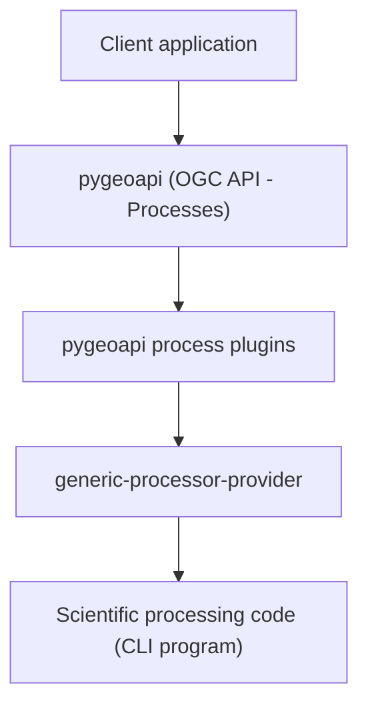

# EXPOSE (EXecutables for OGC API PrOcesses and Scientific Environments) platform

Platform for exposing command‑line scientific programs as
**OGC API - Processes** web services using **pygeoapi** and a
remote execution architecture.

------------------------------------------------------------------------

## Overview

The **EXPOSE (EXecutables for OGC API PrOcesses and Scientific Environments) platform**
is a software architecture
designed to expose command‑line scientific programs as web services
compliant with the **OGC API - Processes** standard.

Many scientific applications are distributed as command-line programs
that require specific runtime environments, dependencies, or operating
systems. Running these programs within a single web service environment
is often difficult due to incompatible software stacks or resource
isolation requirements.

This platform provides a solution that separates:

1.  **API layer** -- exposes processes through the OGC API - Processes
    standard
2.  **Execution layer** -- runs scientific programs in isolated
    environments

The API layer is implemented using the **pygeoapi framework**, which
provides an implementation of the OGC API suite and allows extension
through plugins.

Actual execution of the scientific programs is delegated to lightweight
remote services called **generic processor providers**, which run the
programs on dedicated machines and return results via HTTP.

This architecture allows:

-   isolation of execution environments
-   independent deployment of processing codes
-   reuse of a single API infrastructure for multiple programs
-   a single entrypoint exposing all processing services

------------------------------------------------------------------------

## Design principles

The platform design follows several principles:

-   **Environment isolation** -- programs can run on different machines
    with independent software environments.

-   **Single API entry point** -- all processes are exposed through one
    OGC API.

-   **Minimal execution service** -- the execution service is
    lightweight and flexible.

-   **Decoupled architecture** -- API infrastructure and execution
    environments are independent.

------------------------------------------------------------------------

## Platform architecture

The platform consists of four main layers.

### 1. pygeoapi

The **pygeoapi** framework exposes processes through APIs compliant with
the **OGC API - Processes** standard.

https://pygeoapi.io/

------------------------------------------------------------------------

### 2. pygeoapi process plugins

Repository:

https://github.com/francescoingv/expose-pygeoapi-plugins

Plugins implement the processing logic exposed through pygeoapi.

Responsibilities:

-   validate input/output parameters
-   forward execution requests to the execution service
-   collect execution results
-   format and return results according to **pygeoapi** infrastructure

------------------------------------------------------------------------

### 3. Execution service

Repository:

https://github.com/francescoingv/generic-processor-provider

Responsibilities:

-   receive execution requests from plugins
-   execute configured command‑line programs
-   manage parameters and runtime environment
-   return results via HTTP

------------------------------------------------------------------------

### 4. Scientific processing codes

Scientific codes are **not part of this repository**.

They are executed by the execution service using the configured
`command_line` parameter.

This design allows:

- independent development of scientific codes
- flexible deployment
- reuse of the same execution infrastructure

Currently supported examples:

- **pybox** – scientific processing model to simulate the dispersals
  of a gravity-driven pyroclastic density currents (PDC)
  
  Repository: https://github.com/silviagians/PyBOX-Web
  DOI: https://doi.org/10.5281/zenodo.18920969

- **conduit** – scientific processing model for computing the one-dimensional,
  steady, isothermal, multiphase and multicomponent flow of magma
  in volcanic conduits

- **solwcad** – scientific processing model to compute the saturation surface
  H₂O–CO₂ fluids in silicate melts of arbitrary composition

------------------------------------------------------------------------

## Architecture diagram

------------------------------------------------------------------------

## Logical workflow

1.  A client sends a processing request to **pygeoapi**.
2.  **pygeoapi** forwards the request to the appropriate plugin.
3.  The **pygeoapi plugin** sends the execution request to the
    **generic processor provider**.
4.  The provider executes the scientific program.
5.  Results are returned to the plugin.
6. **pygeoapi** exposes the result through the OGC API interface.

------------------------------------------------------------------------

## Platform components

| Component | Repository | DOI | Role |
|-----------|------------|-----|------|
| processing platform | [expose-pygeoapi-platform](https://github.com/francescoingv/expose-pygeoapi-platform) | https://doi.org/10.5281/zenodo.18892848 | platform architecture |
| pygeoapi process plugins | [expose-pygeoapi-plugins](https://github.com/francescoingv/expose-pygeoapi-plugins) | https://doi.org/10.5281/zenodo.18892819 | OGC API process implementation |
| generic processor provider | [generic-processor-provider](https://github.com/francescoingv/generic-processor-provider) | https://doi.org/10.5281/zenodo.18892842 | remote execution service |

------------------------------------------------------------------------

## Related projects

This platform builds on:

**pygeoapi**\
https://github.com/geopython/pygeoapi\
DOI: https://doi.org/10.5281/zenodo.121585259

------------------------------------------------------------------------

## Related scientific software

Examples of scientific processing codes exposed through this platform:

- **PyBOX-Web**
  Repository: https://github.com/silviagians/PyBOX-Web
  DOI: https://doi.org/10.5281/zenodo.18920969
  
------------------------------------------------------------------------

## Citation

If you use this platform in scientific work, please cite it as:

Martinelli, F. (2026).
*EXPOSE (EXecutables for OGC API PrOcesses and Scientific Environments) platform*.
DOI: https://doi.org/10.5281/zenodo.18892848

------------------------------------------------------------------------

## License

This project is distributed under the MIT License.

See the LICENSE file for details.

------------------------------------------------------------------------

## Author

Francesco Martinelli
Istituto Nazionale di Geofisica e Vulcanologia (INGV)
Pisa, Italy

------------------------------------------------------------------------

## Acknowledgements

Developed at the **Istituto Nazionale di Geofisica e Vulcanologia
(INGV)**.

